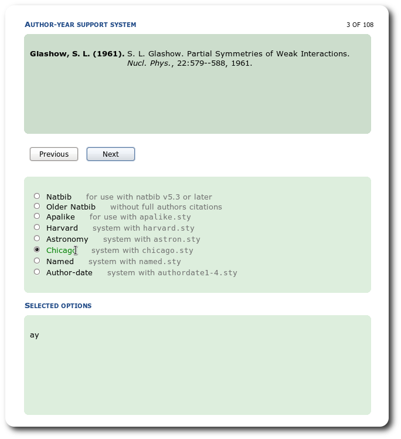
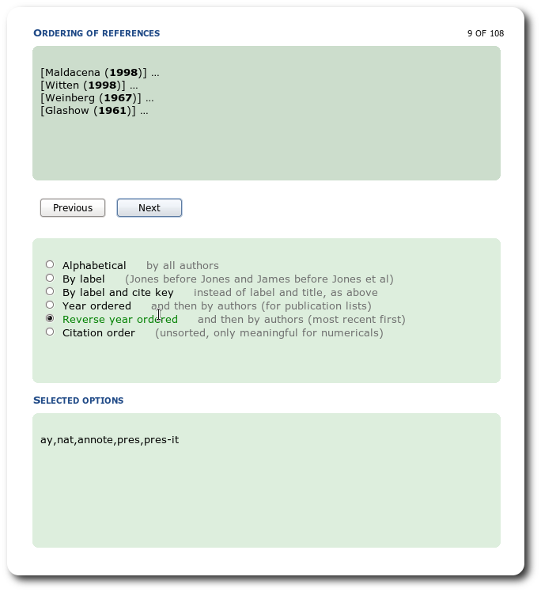
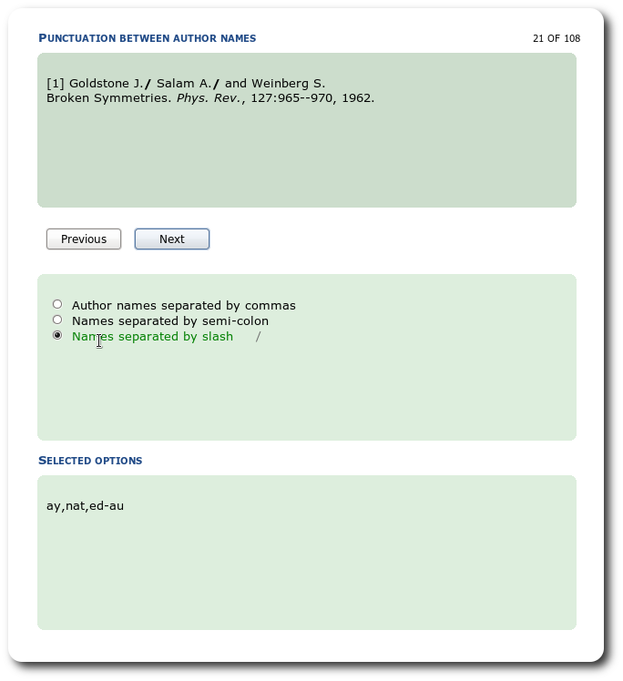
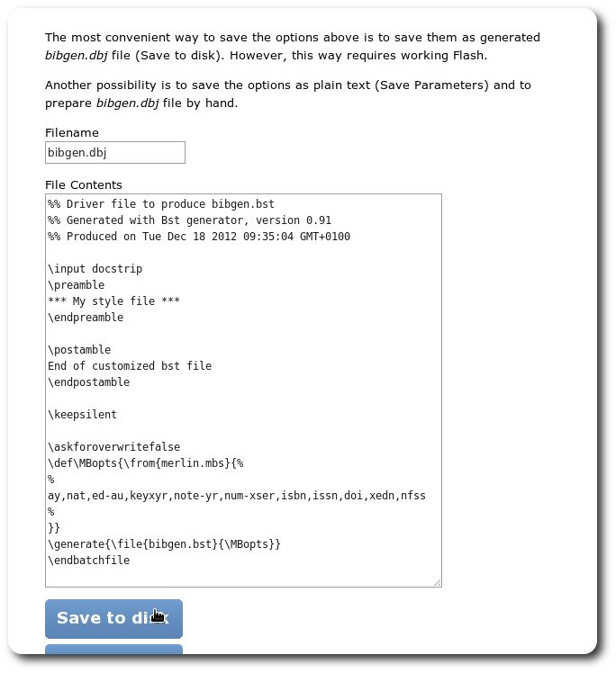

Bst generator
=============

The javascript generator of BST files for BibTeX.
You can create your own style to format the bibliographic entries in Reference part of your manuscript.

The contributors can be found in the file "[AUTHORS](AUTHORS)".

Usage
===================

The port of the script is on the [project web page](https://mezek.github.io/Bst_generator/generator.html).

Preview
=======

Bugs and remarks
================

Bugs can be reported via the [Issue Tracker](https://github.com/Mezek/Bst_generator/issues) of Github.
